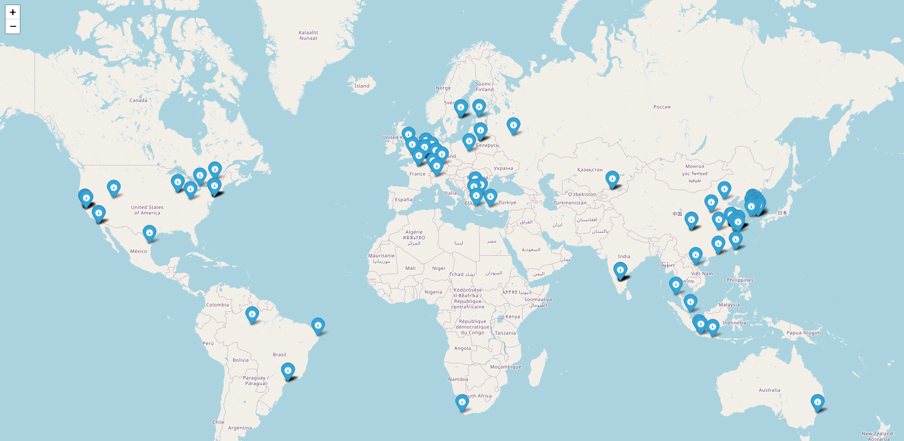
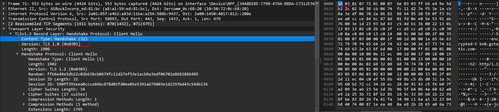

### Why
During one of my classes in uni, we were given a free VM on the cloud for educational purposes.
Our teacher always warned us to shutdown these VM instances once the class was over because they had a public IP and anyone was a step away from bruteforcing that stupidly simple password you just set.
Coincidentially, those days I had just watched a video of John Hammond that used an ssh honeypot for a CTF challenge and then I came up with an idea.
Let's keep the server on for a couple of days and watch what and who attempts what on an "unprotected" system on the intenet.

### The Honeypot
Honeypot is a fake system that has almost the same functionality of a real one but it's isolated and also logs everything (just like the real one). 
It's often used for luring an adversary to enter the system and observe the kind of attacks they use to compromise it. A really useful tool for defense.

The honeypot I used in this scenario is [cowrie](https://www.cowrie.org/).
The setup is fairly simple

```bash
# create a non-root user
sudo adduser --disabled-password cowrie

# Checkout the code from github
git clone http://github.com/cowrie/cowrie

# Setup a python virtual environment and install packages
cd cowrie
python3 -m venv cowrie-env
source cowrie-env/bin/activate
python -m pip install --upgrade pip
python -m pip install -e .
```

Next, we need to configure some properties for cowrie. 
The config file is at `/etc/cowrie.cfg`

1. **Default Port**

    By default, cowrie listens to port 2222. This is already a red flag for an attacker who notices 2 ssh servers existing on different ports. (The real one at 22 at the honeypot at 2222)
    For a more realistic setup I recommend binding cowrie to 22 port and access your server from an internal network. Of course, this is higly dependent on the system setup so configure cowrie accordingly following the [docs](https://docs.cowrie.org/en/latest/INSTALL.html#step-7-listening-on-port-22-optional).
    I personally chose the default cowrie port as I didn't have the choice to turn off the actual ssh server.

2. **Results Output**

    Cowrie has more than enough options for log output. The one I used was MySQL.
    ```bash
    # Install mysql connector inside python venv
    pip install mysql-connector-python

    # Create a `cowrie` database
    mysql -u root -p
    CREATE DATABASE cowrie;

    # Create a Cowrie user account for the database and grant all access privileges
    CREATE USER 'cowrie'@'localhost' IDENTIFIED BY 'PASSWORD HERE';

    # Save and exit
    FLUSH PRIVILEGES;
    exit
    ```

    Lastly, add to `cowrie.cfg` the following
    ```
    [output_mysql]
    host = localhost
    database = cowrie
    username = cowrie
    password = PASSWORD HERE
    port = 3306
    debug = false
    enabled = true
    ```

Once the configuration is done, you can start the honeypot (from inside python venv)
```
source cowrie-env/bin/activate
cowrie start
```

You can verify that cowrie works as intended by connecting to the new ssh port and then watch from your real ssh session the logs at MySQL database
```
mysql -u cowrie -p
USE cowrie;
SELECT * FROM auth;
```

Example output:
```
+----+--------------+---------+----------+-------------+---------------------+
| id | session      | success | username | password    | timestamp           |
+----+--------------+---------+----------+-------------+---------------------+
|  1 | 5748e1c6306d |       1 | root     | R3alPa55w0rd| 2023-12-23 12:06:58 |
...
```

### The Results

I left the honeypot running for 2 days and then I got the results from the database and exported the tables in csv format.
```bash
.
├── cowrie_table_auth.csv # sessions and attempted logins
├── cowrie_table_clients.csv # tty clients
├── cowrie_table_downloads.csv # what files were downloaded (none)
├── cowrie_table_input.csv
├── cowrie_table_ipforwards.csv # attempted connections from my server
├── cowrie_table_ipforwardsdata.csv # the data to the above servers
├── cowrie_table_keyfingerprints.csv
├── cowrie_table_params.csv
├── cowrie_table_sensors.csv
├── cowrie_table_sessions.csv 
├── cowrie_table_ttylog.csv # opened ttys
```

Let's start from the important data: **Logins**

There were more than **6500** authentication attempts from 154 unique IPs. Out of those attempts, 2645 were successfully logged in and that's because I created a user named root with no password.
All other attempts failed simply becaused they guessed the wrong user not the wrong password. Yes, I was so curious to see what will happen that I didn't bother to set up a password. 

Most of these attempts (~4900) came from 83.212.140.151 which resolves to Democritus University of Thrace in Komotini, Greece. That's kinda weird because it's from a university near mine and I suspect the public IP of my server (which is also near this IP) might had been used previously by them.

However, every other IP that attempted a connection came from every part of the world. Most of them were from South Korea.
[Here](/cowrie/ip_locations_map.html) is a map with all the unique IPs.


..And [here](./sessions_ips.csv) is the csv with the above data to get a more clear picture of the ISPs.


Once some of the above IPs successfully connected to the honeypot, a handfull of them attempted connections to other hosts. That's what `cowrie_table_ipforwards.csv` has recorded.
I [consolidated](./forwards_ips.csv) the data and [mapped](/cowrie/ip_forwards_locations_map.html) out again the unique destination IPs.


A majority of these hosts belong to `Yahoo Holdings Inc.`, `Google LLC` and interestingly the Russian `YANDEX LLC`.

But do you wanna know what they attempted to those hosts?

Apparrently all of them connected to http and https ports to Yahoo, Yandex and Google.
If they connected to port 80, the full HTTP request was visible. It was just a GET request to the above hosts.
But a connection to an https service in port 443 showed a slightly different picture.
An example of the data sent:
```
b'\x16\x03\x01\x02\x00\x01\x00\x01\xfc\x03\x03\t\x02\xb5~\xdeX\r\xe4IQt\x0f\xa4\xe7\x85\xb4\x81Y\x97?\x16\x86"\xf2\x06\xaa\xdc\x02\xe4\xbe\xb2\xc1 #y}v\xd8=\xea\x8b\xef\xf8\xb3\xe8?\x1b\xfav\x01\xb4;\xc8.\x04\x80c_a\xfd\x02\xf5\xeapc\x00V\x13\x02\x13\x03\x13\x01\xc0,\xc00\xc0+\xc0/\xcc\xa9\xcc\xa8\x00\x9f\x00\x9e\xcc\xaa\xc0\xaf\xc0\xad\xc0\xae\xc0\xac\xc0$\xc0(\xc0#\xc0\'\xc0\n\xc0\x14\xc0\t\xc0\x13\xc0\xa3\xc0\x9f\xc0\xa2\xc0\x9e\x00k\x00g\x009\x003\x00\x9d\x00\x9c\xc0\xa1\xc0\x9d\xc0\xa0\xc0\x9c\x00=\x00<\x005\x00/\x00\xff\x01\x00\x01]\x00\x00\x00\x13\x00\x11\x00\x00\x0ewww.google.com\x00\x0b\x00\x04\x03\x00\x01\x02\x00\n\x00\x16\x00\x14\x00\x1d\x00\x17\x00\x1e\x00\x19\x00\x18\x01\x00\x01\x01\x01\x02\x01\x03\x01\x04\x00\x10\x00\x0b\x00\t\x08http/1.1\x00\x16\x00\x00\x00\x17\x00\x00\x001\x00\x00\x00\r\x00*\x00(\x04\x03\x05\x03\x06\x03\x08\x07\x08\x08\x08\t\x08\n\x08\x0b\x08\x04\x08\x05\x08\x06\x04\x01\x05\x01\x06\x01\x03\x03\x03\x01\x03\x02\x04\x02\x05\x02\x06\x02\x00+\x00\t\x08\x03\x04\x03\x03\x03\x02\x03\x01\x00-\x00\x02\x01\x01\x003\x00&\x00$\x00\x1d\x00 \r\xb0\xf1\xe1R\xf3\xa4\xe2\t\x8c<\x87\xb7S\xd26N\t\x0b\xbb\x8e\xc6\x86\xd2\xc7\x16\x02;B\xb4\xbe\r\x00\x15\x00\x9a\x00\x00\x00\x00\x00\x00\x00\x00\x00\x00\x00\x00\x00\x00\x00\x00\x00\x00\x00\x00\x00\x00\x00\x00\x00\x00\x00\x00\x00\x00\x00\x00\x00\x00\x00\x00\x00\x00\x00\x00\x00\x00\x00\x00\x00\x00\x00\x00\x00\x00\x00\x00\x00\x00\x00\x00\x00\x00\x00\x00\x00\x00\x00\x00\x00\x00\x00\x00\x00\x00\x00\x00\x00\x00\x00\x00\x00\x00\x00\x00\x00\x00\x00\x00\x00\x00\x00\x00\x00\x00\x00\x00\x00\x00\x00\x00\x00\x00\x00\x00\x00\x00\x00\x00\x00\x00\x00\x00\x00\x00\x00\x00\x00\x00\x00\x00\x00\x00\x00\x00\x00\x00\x00\x00\x00\x00\x00\x00\x00\x00\x00\x00\x00\x00\x00\x00\x00\x00\x00\x00\x00\x00\x00\x00\x00\x00\x00\x00\x00\x00\x00\x00\x00\x00'
```

Under all those gibberish hex data, it's actually a TLS ClientHello handshake. You can find the same structure if you capture a TLS handhake with Wireshark for example and see each field and its respective hex representation.

Although the handshake captured can't show anything useful, one thing stands out and it's not encrypted. That's the server name of the host.

Repeating the same process to all the captured data at [cowrie_table_ipforwardsdata.csv](./cowrie_table_ipforwardsdata.csv), we can say that it's pretty much similar to the unencrypted http requests above including similar hosts. However some sessions sent requests to `ipinfo.io` which is a service that returns info (obviously) for the ip you are connecting from.

So, I think they tried to get some info on the system they are in and then proceed with other actions based on that.

Ok now let's find out what other things they tried once the had a shell to my honeypot!
All the data are included in [cowrie_table_input.csv](./cowrie_table_input.csv)

Almost anyone connected in my server used `uname` to understand the system they are in.
Some were interested just for the system while others attempted to also get the number of processing units with `uname -a;nproc`.
Why would you want to know how many cores my system has? Well, most certainly because you want to run a **cryptominer**

Other commands that stood out:
- Two IPs tried to create a system user and add it to sudo group. 
    ```
    apt update && apt install sudo curl -y && sudo useradd -m -p $(openssl passwd -1 tBMTaMTv) system && sudo usermod -aG sudo system && sudo usermod -aG sudo system
    ```
    Tbh that's an intersting backdoor
- Two IPs run a really interesting payload.
    ```
    ./oinasf; dd if=/proc/self/exe bs=22 count=1 || while read i; do echo $i; done < /proc/self/exe || cat /proc/self/exe;
    ```
    They used a custom binary to extract its first 22 bytes and print them (that's probably the magic bytes of an ELF executable). Then, the command outputs the whole binary.
    Honestly I can't understand what they are trying to do but I can understand why. This is a technique to self extract a malicious binary without writing to disk the extracted data so it does not raise any alarms to antivirus programs and forensics investigations. Unfortunately, the attackers did not proceed further and I can't know what this `oinasf` binary hid.
- Three Chinese IPs run the following reconnaissance commands in this order
  ```
  /ip cloud print
  ifconfig
  uname -a
  cat /proc/cpuinfo
  ps | grep '[Mm]iner'
  ps -ef | grep '[Mm]iner'
  ls -la /dev/ttyGSM* /dev/ttyUSB-mod* /var/spool/sms/* /var/log/smsd.log /etc/smsd.conf* /usr/bin/qmuxd /var/qmux_connect_socket /etc/config/simman /dev/modem* /var/config/sms/*
  echo Hi | cat -n
  ```
  The first one does not seem to be for a Linux system but cowrie recorded it as successful(??). After searching online I found that it's most probably for MikroTik RouterOS. 
  It's an OS running on MikroTik switches and routers. This command would output related info about this MikroTik device (if it was one).
  The next commands simply check if there a "miner" process runs on the system (as if a real miner process would have this name) and then the long `ls` input attempts to enumerate various files related to the router they are interested in.
  Apparently, my honeypot did not tick all the boxes for the system they were looking for and they simply greeted me with a 'Hi'.


### Conclusion
So, if you ever leave a server open on the internet it's most likely gonna be used for cryptomining or scanned for other interesting attacks by the Chinese goverment(?). That's why it's recommended to use very strong ssh credentials or a key pair for login. Always secure your stuff when they are in public.