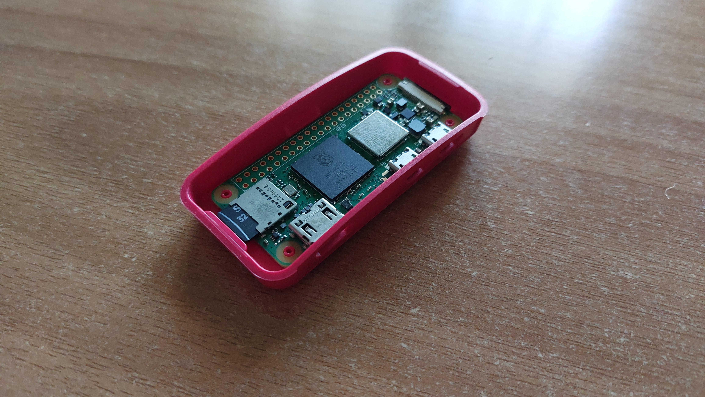
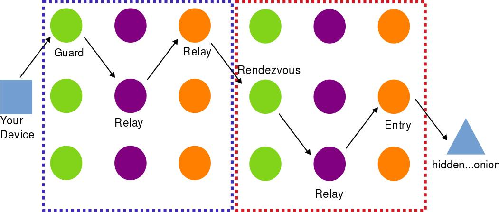

### The Pi Zero 2 W

Recently I got my Raspberry Pi Zero 2 W and I was impressed by its specs. 
With a 4-core ARM processor, bluetooth, WiFi and extra I/O pins it's basically a 20$ computer in the size of your half palm.
It's only downside, the memory with just 512 MB. This is a problem for memory intensive apps but it can teach you valuable lessons about memory limits for your custom projects.


In fact, this device is powerfull enough that you can host a simple website. However, if you plan to do this from your home network please consider a VPS unless you are prepared to deal with port forwarding and static IPs and reverse proxies and...

But if you still wish to run a website from a Pi Zero even from your home network without a complicated setup, you can...on the dark web though :)

### Hidden Services (aka the dark web)

It's ironic that hosting a hidden service is easier than a normal web service on the open internet and that's because the architecture of the TOR network.

As you may know, when you connect to a ("normal") website through TOR, your traffic passes from a circuit of TOR nodes and the last one (exit node) actually makes the requests to the server.
This way, the server cannot know your identity as you are behind 3 proxies of TOR nodes.
When you connect to a hidden service though (e.g an onion website), it's not just you behind 3 proxies but also the website/service you are connecting to. This is why it's called a hidden service as neither you nor the website know the real identity of any party involved. The communication happens between the "edge" of these circuits called 'rendezvous point'. If you are lost with my explanation [here](https://community.torproject.org/onion-services/overview/) is the official in-depth explanation.



In order for the server to accept traffic it needs to connect first to the entry node and then another relay and finally to the rendezvous point. Actually, the server creates multiple such circuits so it's easier for clients to find it and also they are updated often to avoid de-anonymization attacks. But since the server connects its the entry node, it acts like a **proxy** outside of any NAT or firewall. That's why you can host a hidden service from your home network **bypassing** the limits of your ISP router.

### My hidden service

The setup of the pi zero is quite simple. You will need an SD card with at least 8 GB storage and a micro-usb power supply (any mobile charger works too).
Maybe you'll need an SD to USB adaptor but that's up to you.
From the software side, I highly recommend [Pi Imager](https://www.raspberrypi.com/software/). Once installed, simply follow the instructions of the app or check [this](https://www.tomshardware.com/reviews/raspberry-pi-headless-setup-how-to,6028.html) tutorial in case you are confused. (Note: I recommend Pi OS Lite due to memory limitations and you won't need the desktop anyway).

If everything went well, you should have an SSH access to your pi zero. You are ready to host your website.

Instead of creating my own website, I wanted something pre-build instead. Sorry, I'm not a web developer.
Since we want to offer something to the 'dark web' (within legal limits of course) I thought the best approach is a temporaty file hosting service. I believe this kind of service is quite popular and a quick search in available services verifies this.

After another search on github for open-source projects of this kind I found [Uguu](https://github.com/nokonoko/Uguu). This is perfect as it is PHP based and does not require enabled Javascript. A golden rule for .onion sites. However, I had to make some modifications for this project in order to function as a hidden service. All changes are at `extraFiles` folder at my [github repo](https://github.com/nu113d/Temp-Dump-hidden-service)

For the setup, the [official](https://github.com/nokonoko/Uguu/wiki/Uguu-Configuration-&-Installation) instructions cover the majority of what you'll need to do.

Below is a quick recap

```bash
#Install requirements
apt-get install build-essential pngquant nginx-full php8.3-fpm php8.3 sqlite3 php8.3-sqlite3 \
php8.3-curl unzip git php8.3-cli php8.3-opcache php8.3-apcu \
php8.3-mcrypt php8.3-mysql php8.3-pgsql php8.3-zip \
php8.3-common php8.3-readline php8.3-bcmath php8.3-common php8.3-xml

#In case you can't install php8.3 run the following commands before (for debian)
curl -sSL https://packages.sury.org/php/README.txt | sudo bash -x
sudo apt update

#Next install bun
curl -fsSL https://bun.sh/install | bash
source ~/.bashrc

#dirs
mkdir /var/www
mkdir /var/www/uguu # Move my repo here
mkdir /var/www/db
mkdir /var/www/files

sqlite3 /var/www/db/uguu.sq3 -init /var/www/uguu/src/static/dbSchemas/sqlite_schema.sql ""

chown www-data:www-data /var/www/db
chown www-data:www-data /var/www/db/uguu.sq3
chown www-data:www-data /var/www/files
chmod -R 775 /var/www
```

**Nginx and other configs**

Inside `extraFiles` folder you will find the default nginx.conf but with some extra directives for security. It's important that `client_max_body_size 256m;` must match the max upload file size you want.

You can safely replace nginx.conf with the one in `/etc/nginx`

`uguu.conf` is the actual configuration of the website (name it whatever you want). The `server_name` is localhost because incoming traffic is redirected from the web server to the local Tor process. This is how the server can't know the origin of the client. Also there is no SSL config and there is no need for one as stated [here](https://community.torproject.org/onion-services/advanced/https/). (TLDR; the .onion addreess is already the public key of the service and it's encrypted by default)


Next, edit `/etc/php/8.3/fpm/php.ini` and change the following:

- `upload_max_filesize` defines the max size a file is allowed to be, so in this case set this to 128M.
- `post_max_size` defines how much data we can send in a single POST, setting this to 256M should be fine (128M * 2).

As a last step, you need to edit `/src/config.json` which includes almost everything you see on the website. (Again, more info from the [official wiki](https://blog.torproject.org/facebook-hidden-services-and-https-certs/) )

Now, create a new cronjob to permanently delete the expired uploaded files with `crontab -e` (example at `extraFiles/cronjob`)
```bash
#Run file expiration check every 5 minutes
*/5 * * * * /usr/bin/php8.3 /var/www/uguu/dist/checkExpire.php
```

**Build**

```bash
cd /var/www/uguu/
bun install
make
make install
```

**TOR Configuration**
```bash
#Install tor
sudo apt install tor
```

Edit `/etc/tor/torrc` and uncomment the following lines
```
HiddenServiceDir /var/lib/tor/my_website/
HiddenServicePort 80 127.0.0.1:80
```
`HiddenServicePort` should match the `listen` directive in `uguu.conf`

```bash
#Restart tor, nginx and php
service restart tor
service nginx restart
service php8.3-fpm restart
```
THAT'S IT!

Now take the onion address from `/var/lib/tor/hidden_service/hostname`. This is your hidden service!

**Extra**

If, for any reason, you want to keep a copy of the uploaded files even after they have expired add the following cronjob (example at `extraFiles/cronjob`)
```bash
*/4 * * * * /usr/bin/rsync -a "/var/www/files" "/home/your_user"
```

Now just plug your pi zero and keep it on. In the background it will connect to a number of TOR nodes to create a circuit and you can monitor the traffic with [nyx](https://nyx.torproject.org/).

Congrats! Your website is up and running!

### Closing thoughts

My experience with this project was kinda dissapointing. After submitting my .onion address to a handfull of search engines, eventually I got zero traffic for a whole month.
But anyways, I'm happy with the new knowledge I got.