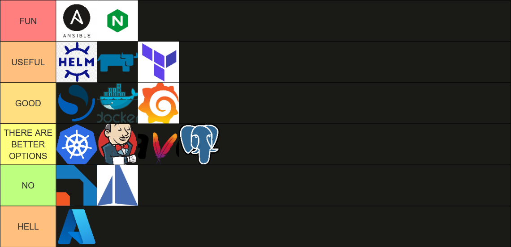

Below is my personal opinion on some software that I've used as a DevOps Engineer.

### Ansible
Ansible is a simple tool. Write a list with some VMs, write another .yaml file with the modules you want to and you're done. Automation made easy. No extra drama, and actually useful errors. Although the documentation 
is missing specific details sometimes, it's straightforward and actually fun to work with.

### Nginx
Probably the best web server to exist. Almost everything you need to configure is in `nginx.conf`. 
Read the excellent documentation and you can do anything you want.

### Helm
Helm is a useful tool in order to setup an application in Kubernetes. With its simple project layout it quite clear to understand what goes where. Moreover, with Helm you can integrate and customize any third-party application you want to run in K8s by editing `values.yaml`. Just make sure to read the chart's documentation thoroughly. However, if you want to create your own chart you need to understand the templating syntax which is quite strange to say the least.

### Rancher
Rancher is basically a UI for Kubernetes. You can create any k8s resource possible with 0 yaml code and also provides realtime updates for resources without any lag. It's perfect for beginners to learn and advanced users to manage such a complicated concept.

### Terraform
Terraform is a IaC tool that creates cloud infrastructure with scripts. I've personally used it with Azure cloud, but Azure aside, it's relatively simple to setup and even simpler to learn with the excellent documentation.

### Opensearch and Grafana
OpenSearch, OpenSearch Dashboards, and Grafana together form by far the best open-source stack for analyzing logs and monitoring a system. OpenSearch delivers fast, scalable search and log analytics, OpenSearch Dashboards gives you powerful built-in visualizations, and Grafana adds dashboards, alerting, and the ability to correlate logs with metrics and traces, all in one cohesive and customizable platform.

### Docker
Docker solves myriads of problems and creates even more when it's overused. Personally, I think it's a great tool that's easy to master but problems can arise anytime.
However my experience has shown that any problem can be fixed relatively quickly. Once you undestand docker you will never forget it. And how can you be mean with such a logo :)

### Kubernetes
You will never learn Kubernetes if you haven't worked in a huge corporate project but you won't get hired if you have no experience.
Project managers love it because it solves problems that don't exist most of the time. Honestly, it’s extremely complicated, with an overwhelming number of definitions, resources, and concepts that make it feel like an endless rabbit hole.
Yes, it's necessary when it's truly necessary but even then don't expect to learn everything even with years of hands-on experience. Also it's very forgettable once you step away from it. 
Thankfully, the official documentation is crystal-clear and remains one of its strongest assets.

### Jenkins
Jenkins is one of the most used tools for CI/CD pipelines and automation. Although its broad usage, its okay-ish UI and it's numerous features, it suffers from bugs along with slow performance and a mediocre documentation. 
Moreover, it's Groovy integration is another obstacle for writing pipelines. Groovy is shit, seriously. It's a wannabe version of Java with all the cons of it and extra weirdness.
(Fun fact: a private method in Groovy is never private and can be called from anywhere. It's a [bug](https://issues.apache.org/jira/browse/GROOVY-1875) that is open since 2007 and won't be fixed!)

### Maven
Maven's philosophy with depenencies and artifacts is great. But I hate `pom.xml`. Actually, I hate XML's in general. Nevetheless, it's not hard to master.

### Postgresql
PostgreSQL is a solid relational database that powers many production systems. That said, it often feels heavier than necessary for a lot of modern workloads. Configuration, replication, and performance tuning can become time-consuming, and scaling it horizontally still requires expertise.
It’s necessary when it’s necessary, but in most situations you’ll end up wishing for something simpler.

### Defectdojo
It's a tool that consolidates the results of security scans. I'm not sure how famous it is but it's UI is borderline terrible and chaotic.

### istio
Basically it's part of Kubernetes. It's an alternative to k8s ingresses but for heavy workloads and dozens of microservices. It's useful then and only then however you'll have to learn another rabbit hole of concepts

### Microsoft Azure
I can write a whole post about how much I despise Microsoft but I'll try to keep it small. Azure is one of the largest cloud providers in the world, yet it somehow manages to be one of the most painful to work with. Pretty much everything about it feels like a struggle.
Problems can arise even before you log in (if you manage to successfully authenticate yourself) and then an almost broken UI that feels like a prototype website of a second-year university student.
Pop-ups about trivial warnings and ads about how awesome Copilot is making it far too easy to misclick and break something.
On top of that, it's messed up documentation is not making things any clearer (most of the time). In the end, Azure proves that scale and market share don’t equal usability,at all.

